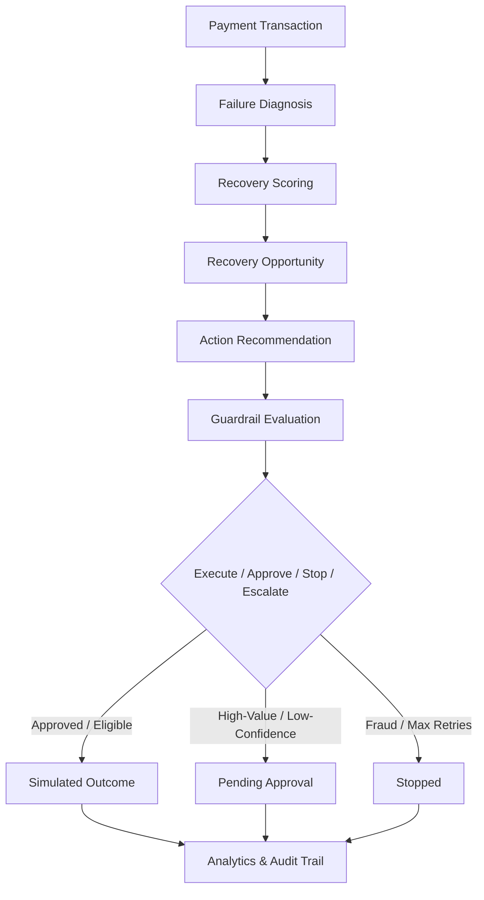

# RecoverAI — Explainable AI Revenue Recovery Agent

RecoverAI identifies recoverable payment failures, recommends appropriate recovery actions, applies safety guardrails, measures simulated recovery outcomes, and maintains an audit trail.

# Live Link : 
https://recoverai-revenue-recovery-five.vercel.app/

## Razorpay AI Builder Internship 2026
**Track:** Track 3 — AI Revenue Recovery

---

## The Problem
Revenue leakage from failed, declined, or abandoned payment transactions is a multi-billion dollar problem in digital commerce. Standard transactional retry strategies typically fail due to two key issues:
1. **Naive Retry Overhead**: Blindly retrying every failed transaction clutters customer feeds, increases card network fees, and runs the risk of merchant account suspension for high decline rates.
2. **One-Size-Fits-All Outreach**: Technical gateway timeouts need an immediate retry, whereas insufficient fund issues need a delayed payment link, and suspicious card flags require account verification instead of communication.

To prevent revenue loss, merchants require an automated agent that can diagnose failures, calculate recovery likelihood, select the optimal outreach channel, check compliance guardrails, and log an audit trail for evaluators.

---

## The Solution
RecoverAI implements a bounded, explainable recovery-agent workflow that processes transactions through a multi-stage pipeline:



### Flow Lifecycle Stages:
1. **Failure Diagnosis**: Analyses payment gateway codes (e.g., `INSUFFICIENT_FUNDS`, `FRAUD_SUSPECTED`, `LIMIT_EXCEEDED`, `NETWORK_ERROR`).
2. **Recovery Scoring**: Predicts recovery probability (0-100) based on customer transaction success rate, payment method history, and gateway logs.
3. **Recovery Opportunity**: Generates a structured opportunity tracking expected value and priority level (`CRITICAL`, `HIGH`, `MEDIUM`, `LOW`).
4. **Action Recommendation**: Recommends the action (`SMART_RETRY`, `PAYMENT_LINK`, `EMAIL_REMINDER`, `SMS_REMINDER`) and channel with custom timing delay.
5. **Guardrail Evaluation**: Evaluates transaction parameters against 7 safety rules.
6. **Execution Decisions**: Binds outcomes into:
   - **`STOPPED`**: Blocked under safety rules.
   - **`PENDING_APPROVAL`**: Suspended for merchant review.
   - **`EXECUTING`**: Released to target channel.
7. **Simulated Outcome**: Runs a deterministic outcome simulation based on transaction history and customer parameters.
8. **Analytics & Audit**: Logs transitions to an immutable audit ledger and updates metrics.

---

## What Makes RecoverAI Different
Unlike basic analytics charts, RecoverAI functions as an autonomous, safety-bounded agent:
* **Explainable Decisioning**: Calculates and explains every score with natural language rationales.
* **Bounded Autonomy**: The agent operates under strict merchant limits; it cannot run wild or span infinite retries.
* **Safety Guardrails**: Backend checks intercept every execution to prevent unauthorized outreach or duplicate messaging.
* **Measurable Recovery**: Transparently separates estimated recovery expectations from actual simulated recovery figures.
* **Human-in-the-Loop**: Safely escalates high-risk or high-value cases (>₹25k) to manual review.

---

## Core Features
- **Revenue-at-Risk Dashboard**: Real-time aggregation of transaction values, estimated recoverable amounts, and average success rates.
- **Explainable AI Inspector**: Details the exact logical reason codes (e.g., historical user success rate, failure classification, and retry thresholds) inside every opportunity card.
- **7-Rule Safety Guardrails**: Assessment checklist of max retry counts, customer frequency caps, fraud validations, and high-value approvals.
- **Batch Recovery Simulation**: Runs simulations across slices of 25, 50, or 100 failed transactions to test recovery strategies.
- **Realized Performance Analytics**: Graphs estimated vs. actual recovered revenues and tracks stop/escalation rates.
- **Immutable Agent Audit Trail**: A complete log table mapping actions (`AI_ANALYSIS`, `RECOVERY_STOPPED`, `APPROVAL_REQUIRED`) to their previous and transition states.

---

## AI Decision Engine
To ensure high reliability, RecoverAI uses a structured, explainable scoring engine in [scorer.ts](file:///c:/Users/Svara/Downloads/TECH/PROJECTS/RecoverAI/server/src/ai/scorer.ts) instead of an unconstrained generative LLM:
* **Scoring Rules**:
  - `Base Score`: Determined by failure reasons (technical errors have high recoverability; fraud has 0%).
  - `Customer Adjustment`: Boosted by the customer's historical success rate and reduced by their overall transaction risk score.
  - `Confidence`: Computed from historical profile volume and payment method age.
* **Formulae**:
  - **`expectedValue`**: `estimatedRecoverableAmount * (recoveryScore / 100)`
  - **`priority`**: Assigned based on amount thresholds (Critical for >₹50k, High for >₹15k, Medium otherwise).
  - **`recommendedChannel`**: Selects `RETRY` for network errors, `EMAIL` for card declines, and `SMS`/`WHATSAPP` for abandons.

> [!NOTE]
> **Engineering Decision**: Using a deterministic decision tree prevents non-deterministic "hallucinations" or rate-limiting delays from executing payment actions. The engine is modularly separated (`runFullAnalysis`), allowing you to swap it with a production LLM classifier (e.g., Gemini API) without bypassing the guardrails system.

---

## Guardrails & Bounded Autonomy
The backend enforces 7 safety rules defined in [appSettings](file:///c:/Users/Svara/Downloads/TECH/PROJECTS/RecoverAI/server/src/routes/index.ts) before any outreach takes place:

| Guardrail Rule | Target Check | Threshold Value | Violation Action |
| :--- | :--- | :--- | :--- |
| **Rule 1: Retry Cap** | Cumulative attempts | 3 maximum | Transition to `STOPPED` |
| **Rule 2: Exclusions** | Permanent failures | `FRAUD_SUSPECTED`, `INVALID_CARD` | Transition to `STOPPED` |
| **Rule 3: High Value Limit** | Transaction amount | > ₹25,000 | Transition to `PENDING_APPROVAL` |
| **Rule 4: Confidence Cap** | AI Confidence rating | < 50% | Transition to `PENDING_APPROVAL`/`ELIGIBLE` |
| **Rule 5: Customer Limit** | Customer failed count | 6 failures | Transition to `STOPPED` |
| **Rule 6: Deduplication** | Current state | `RECOVERED` | Block further outreach |
| **Rule 7: Escalation Policy** | Multi-failure limit | Max retries reached | Transition to `ESCALATED` |

---

## Recovery Measurement
To evaluate performance, the system distinguishes:
1. **Revenue at Risk**: Total transaction value of all failed payments.
2. **Expected Recovery**: Target recovery value calculated as `Amount * Recovery Score %`.
3. **Actual Simulated Recovery**: Calculated payments successfully completed through simulation runs.

The Analytics page tracks the **Recovery Lift** over baseline (assumed baseline of 15% manual payment recovery) to quantify agent performance.

---

## Audit Trail
Every state change writes an entry to the database:
- `AI_ANALYSIS`: Logged when an opportunity is created.
- `APPROVAL_REQUIRED`: Triggered when an execution violates Rule 3 (High-Value) or Rule 4 (Low-Confidence).
- `RECOVERY_STOPPED`: Logged when Rule 1, 2, or 5 stops outreach.
- `RECOVERY_SUCCEEDED`: Logged upon successful simulated payment.
- `RECOVERY_FAILED`: Logged upon failed simulated payment.

---

## Architecture
```
[React + Vite Frontend (Port 5173)]
              ↓ (REST API Calls)
[Express + TypeScript Server (Port 3001)]
              ↓
  [Recovery Service (Guardrail Engines)]
              ↓
  [Modular AI Scoring & Diagnosis]
              ↓
      [Prisma Client Layer]
              ↓
    [dev.db (SQLite Database)]
```

---

## Tech Stack
* **Frontend**: React, TypeScript, Vite, Tailwind CSS, Recharts (charts), Radix UI (dialog modals), Lucide (icons).
* **Backend**: Node.js, Express, TypeScript, Prisma (ORM), SQLite (local database).

---

## Project Structure
```
RecoverAI/
├── client/                 # React frontend
│   ├── src/
│   │   ├── components/     # AppShell, Sidebar, Header
│   │   ├── hooks/          # useFetch API loading hook
│   │   ├── lib/            # api client and utility helper formatting
│   │   ├── pages/          # Overview, Transactions, Recovery, Analytics, AuditLog, Settings
│   │   └── types/          # Frontend type definitions
│   └── tsconfig.app.json
├── server/                 # Express backend
│   ├── prisma/             # SQLite dev.db schema and migration scripts
│   ├── src/
│   │   ├── ai/             # Scorer engine, timing analytics, and types
│   │   ├── routes/         # Express router controllers
│   │   ├── services/       # recoveryService, analyticsService, dashboardService
│   │   └── server.ts       # Application bootstrap
│   └── tsconfig.json
└── README.md
```

---

## API Overview
* `GET /api/transactions` — Retrieves payment records.
* `POST /api/transactions/:id/analyze` — Run diagnostics on transaction.
* `GET /api/recovery` — List opportunities.
* `POST /api/recovery/:id/execute` — Execute outreach.
* `POST /api/recovery/batch-run` — Runs simulation batch.
* `GET /api/recovery/performance` — Returns realization stats.
* `GET /api/recovery/audit-log` — Returns chronological audits.
* `GET /api/recovery/guardrails` — Returns settings parameters.

---

## Demo Walkthrough

To review the project workflow:
1. **Overview Page**: View global Revenue at Risk metrics.
2. **Recovery Page**:
   - Click on an opportunity card to open the **Opportunity details**.
   - Check the **AI Explanation**, **Expected Value**, and **Guardrails Assessment** checklists.
   - Click **Run Recovery Batch** to configure a simulation batch size of 25.
   - Click **Execute Simulation Batch** and review the recovered revenue and stopped/escalated actions.
3. **Audit Trail**: Check the sidebar and review chronological logs for previous/transition states.
4. **Analytics Page**: View the **Recovery Lift** card and compare **Estimated vs. Actual Recovery** on the bar chart.
5. **Settings Page**: Modify the **AI Confidence Threshold** using the slider.

---

## Local Setup

### 1. Prerequisites
- Node.js (v18+) and npm installed.

### 2. Installation & Setup
Run the following commands in the workspace root:

```powershell
# Install root, backend, and frontend dependencies
npm install
cd server; npm install
cd ../client; npm install

# Build Prisma clients and create database
cd ../server
npx prisma db push

# Seed transaction records (500 payments, 80 customers, 161 opportunities)
npm run seed
```

### 3. Startup
Start backend and frontend dev servers concurrently from the root directory:
```powershell
cd ..
npm run dev
```
- Open Frontend: [http://localhost:5173](http://localhost:5173)
- API endpoint: [http://localhost:3001/api](http://localhost:3001/api)

---

## Production Deployment

### Frontend (Vercel)
1. In your Vercel Dashboard, select **Add New Project** and import the repository.
2. Set the **Framework Preset** to `Vite`.
3. Set the **Root Directory** to `client`.
4. Configure the following environment variables:
   - `VITE_API_URL`: The URL of your deployed backend service (e.g. `https://recoverai-backend.onrender.com`).
5. Click **Deploy**.

### Backend & Database (Render)
This project includes a [render.yaml](file:///c:/Users/Svara/Downloads/TECH/PROJECTS/RecoverAI/render.yaml) blueprint specification that automatically provisions both the Web Service and PostgreSQL Database:
1. In your Render Dashboard, navigate to **Blueprints** and click **New Blueprint Instance**.
2. Select your repository and connect it.
3. Review the environment variables:
   - `PORT`: Set to `3001` (default).
   - `NODE_ENV`: Set to `production`.
   - `FRONTEND_URL`: Set to your deployed Vercel URL (e.g. `https://recoverai-revenue-recovery.vercel.app`).
4. Click **Apply** to automatically provision the PostgreSQL database and build/deploy the backend.

Manual database migrations are executed automatically during the build step using:
```bash
npx prisma migrate deploy
```

---

## Testing & Verification
The codebase is validated and tested:
- **Frontend Build**: Verified via Vite compiler.
- **Backend Build**: Verified via tsc compiler.
- **TypeScript Check**: `npx tsc --noEmit` returns zero errors.
- **Linter Check**: `oxlint` returns zero warnings and errors.
- **E2E verification tests**: [test_flow.ts](file:///c:/Users/Svara/Downloads/TECH/PROJECTS/RecoverAI/server/scratch/test_flow.ts) ran successfully.

---

## Limitations
- **Simulated Recovery**: Payment completions and outreach outcomes are generated through transaction-level statistical profiles rather than real merchant webhook callbacks.
- **Synthetic Profiles**: Card details, emails, and transaction numbers are mock structures generated for localized evaluator execution.

---

## Future Improvements
- **Online evaluation**: A/B testing framework comparing different scoring algorithms.
- **Generative explanation**: Integrating Gemini APIs for natural language email/SMS templates based on buyer history.
- **Webhooks**: Direct support for Razorpay payment webhooks to automatically trigger diagnostics upon checkout failures.

---

## Safety Disclaimer
RecoverAI is a prototype using synthetic transaction data. It does not process real payments, move real money, or interact with live payment credentials.
